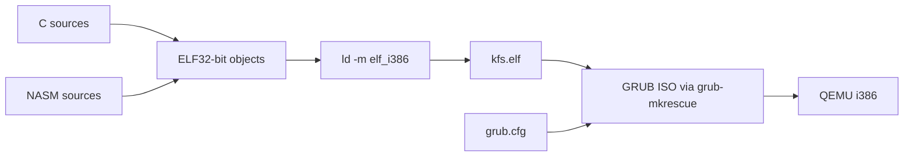
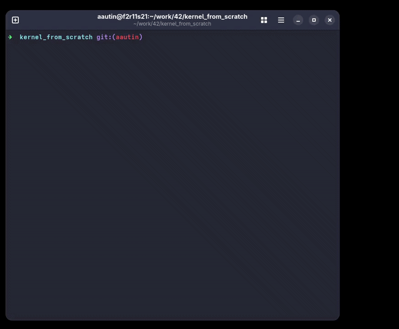
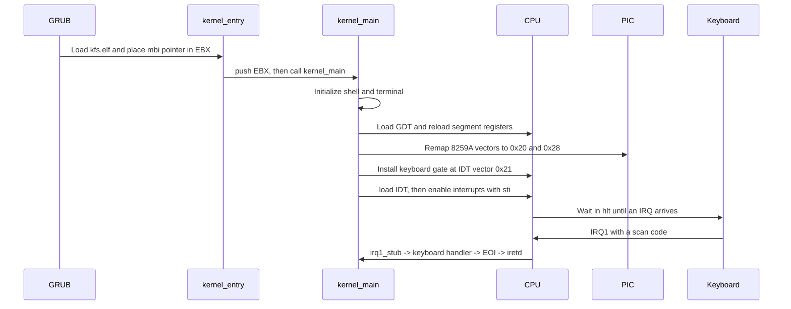
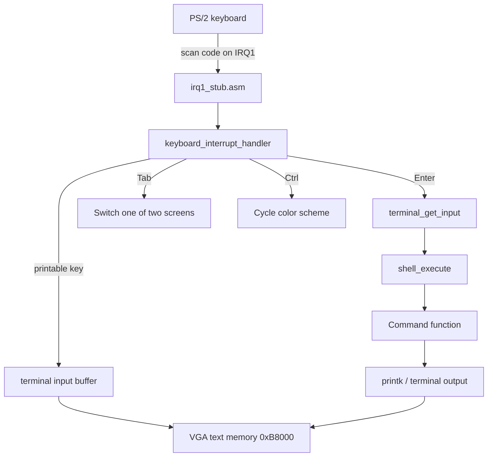

# Kernel From Scratch

A small 32-bit x86 kernel written in C and NASM assembly. It boots through GRUB, configures the processor and legacy interrupt controller, then presents a VGA text-mode shell that accepts keyboard input.

> This is an educational kernel, not a Linux distribution and not a drop-in replacement for the Linux kernel. The Linux comparison below is included to make that boundary explicit.

## Contents

- [Build and run](#build-and-run)
- [Kernel in action](#kernel-in-action)
- [Using the kernel](#using-the-kernel)
- [How the kernel works](#how-the-kernel-works)
- [What this kernel and Linux have in common](#what-this-kernel-and-linux-have-in-common)
- [Project structure](#project-structure)
- [The remaining work to be done](#the-remaining-work-to-be-done)

## Build and run

### Requirements

Install the following on the host:

- `make`
- GCC with 32-bit compilation support (`gcc -m32`)
- GNU `ld` with i386 output support
- `nasm`
- Docker, used to build the GRUB bootable ISO with `grub-mkrescue`
- `qemu-system-i386`, used by the `run` target

The Docker image installs the ISO-specific packages itself:

- `grub2-common`
- `grub-pc-bin`
- `xorriso`

### Commands

```sh
# Build kfs.elf, place it in the ISO tree, and create iso/bootable_kernel.iso
make

# Build and boot the ISO in an i386 QEMU machine
make run

# Remove intermediate objects
make clean

# Remove objects, the ELF, and the ISO directory contents
make fclean

# Clean and rebuild everything
make re
```

The build pipeline is:



The kernel is freestanding: it is compiled with `-ffreestanding`, `-fno-builtin` and `-nostdlib`, then linked with the project linker script rather than a host operating-system runtime.

## Kernel in action



## Using the kernel

After `make run`, GRUB loads `kfs.elf` and the screen shows the `42> ` prompt. Commands are typed through the PS/2 keyboard interrupt handler.

| Command | Purpose |
| --- | --- |
| `help` | List the available commands |
| `clear` | Clear the current terminal |
| `last` | Run the previous command again |
| `pmultiboot` | Print memory information supplied by GRUB |
| `pstack` | Dump the current kernel stack |
| `reboot` | Ask the PS/2 controller to reboot the machine |

Keyboard controls:

- `Caps Lock` toggles the simple alphabetic uppercase mode.
- `Backspace` deletes input characters.
- `Enter` executes the current input line.
- `Tab` switches between the two in-memory terminal screens.
- `Ctrl` cycles the terminal color scheme.
- `Key Up` and `Key Down` scroll the current terminal buffer.

## How the kernel works

### Boot sequence

The boot entry point is reached by GRUB in 32-bit protected mode. GRUB passes the Multiboot information pointer in `EBX`; the assembly entry point forwards it to `kernel_main`.



The linker script places the GDT section near `0x800`, loads the Multiboot header and kernel at the 1 MiB boundary, defines the BSS boundaries, and reserves a 16 KiB kernel stack. The boot code disables interrupts while this setup is performed.

### CPU protection and interrupts

The kernel creates a Global Descriptor Table (GDT) containing null, kernel code/data/stack, and user code/data/stack descriptors. The user descriptors are prepared for future work; this repository does not switch to user mode.

The Interrupt Descriptor Table (IDT) has 256 entries, but this version installs only the keyboard gate. The legacy 8259A Programmable Interrupt Controller is remapped so hardware IRQs do not overlap CPU exception vectors:

```text
CPU exceptions     0x00 - 0x1F
Master PIC IRQs    0x20 - 0x27   (IRQ1 keyboard = 0x21)
Slave PIC IRQs     0x28 - 0x2F
```

The IRQ1 assembly stub saves registers, reads port `0x60`, calls the C keyboard handler, sends an End Of Interrupt command to the master PIC, restores registers, and returns with `iretd`.

**Why did we setup this whole interrupt environment?** 
The kernel is now ready to receive keyboard input asynchronously, without polling. The CPU can `hlt` until a key is pressed, and the keyboard interrupt will wake it up. This method has several advantages over polling:
- CPU cycles are not wasted checking for input when there is none
- The kernel can add more interrupt handlers and still be effectively responsive to every event
- The CPU exception can be handled in the same way as hardware interrupts
- The PIC and CPU are used for their intended purpose

### Keyboard, terminal, and shell flow



The terminal keeps two complete screen buffers. Each buffer is 80 columns by 50 logical rows: 25 visible VGA rows plus 25 rows that can be scrolled into view. `put_screen` copies the selected buffer to VGA text memory, while the hardware cursor is updated through VGA ports `0x3D4` and `0x3D5`.

`printk` is a small project-local formatter. It supports the format cases used by the shell (`%c`, `%s`, `%d`/`%i`, `%x`, `%llx`, `%p`, and `%%`); it does not provide the complete hosted C `printf` contract.

## What this kernel and Linux have in common

Concepts such as GDTs, IDTs, PICs, interrupt gates, privilege rings, port I/O, and `hlt` are real x86 mechanisms. Their small-scale use here is specific to this project. The project should therefore be read as a learning implementation of selected kernel building blocks, not as a miniature copy of Linux's complete architecture.

## Project structure

The main ownership boundaries are:

- `boot` and `sections`: get from GRUB to C code and define link-time layout.
- `gdt`, `interrupt`, and `pic`: establish the processor and hardware interrupt environment.
- `io` and `terminal`: turn low-level device access into a text interface.
- `keyboard` and `shell`: turn scan codes into commands.
- `helper`: provide the small freestanding runtime this kernel needs instead of relying on libc.

## The remaining work to be done

We identified the following areas for future work that anyone is welcome to contribute to:

- Paging and a general physical/virtual memory allocator.
- User mode, processes, threads, scheduling, and system calls.
- CPU exception handlers beyond the default hardware behavior.
- Timers, disks, filesystems, networking, USB, and modern display output.
- A libc, command parsing with arguments, or persistent storage.
